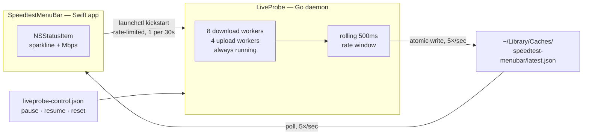

# SpeedBar — live network speed in the macOS menu bar

A always-on network speed readout for the macOS menu bar. Live download and upload
throughput in Mbps, updated 5× per second, with sparklines and session peaks.

```
▁▂▃▅ 298  ▁▁▂▂ 46
 download    upload
```

Unlike a "run a speedtest now" utility, this measures **continuously** — the number
in your menu bar is what your link is doing right now, not what it did the last time
you asked.


---

## Always-on by design

Measurement is continuous. Eight download workers and four upload workers run in
parallel, permanently, and the number in the menu bar is derived from that traffic.

That is a deliberate choice. Sampling in bursts and showing the last result between
them was tried and rejected: it makes the readout a stale figure most of the time, and
the whole point of this widget is that the number is true *now*. Continuous measurement
costs real bandwidth; it buys a reading you can trust at a glance.

---

## Architecture

Two processes, decoupled by a single JSON file. Neither talks to the other directly.



| Component | Language | Role |
|---|---|---|
| `LiveProbe/` | Go | Generates traffic, measures throughput, writes `latest.json` |
| `SpeedtestMenuBarApp/` | Swift / AppKit | Renders the menu bar item, supervises the probe |
| `latest.json` | — | The only interface between them |
| `liveprobe-control.json` | — | Control channel: `pause`, `resume`, `reset` |

Both run as user LaunchAgents, so they start at login and survive crashes.

---

## Install

### Option A — download the app

Grab `SpeedtestMenuBar.app.zip` from [Releases](../../releases), unzip it, and move
`SpeedtestMenuBar.app` to `/Applications`.

The app is **self-contained**: it carries the probe inside its bundle and installs the
probe plus its LaunchAgent on first launch. Nothing else to install.

> **Gatekeeper.** The app is ad-hoc signed, not notarized (notarization needs a paid
> Apple Developer account). macOS will refuse to open it after download until you strip
> the quarantine flag:
>
> ```bash
> xattr -dr com.apple.quarantine /Applications/SpeedtestMenuBar.app
> ```
>
> Then open it normally. If you would rather not trust a binary from the internet —
> reasonable — build from source instead; it takes about ten seconds.

To have it start at login, the app writes its own probe LaunchAgent, but the app's own
agent is only installed by the source install below. Add it manually with
System Settings → General → Login Items, or run `./install.sh` from a clone.

### Option B — build from source

Requirements: macOS 14+, Go 1.22+, Swift 5.9+ (Xcode command line tools).

```bash
./install.sh
```

That builds both components, installs them, writes both LaunchAgents, and verifies
each is running. To install just one side, run `LiveProbe/Scripts/install.sh` or
`SpeedtestMenuBarApp/Scripts/install.sh`.

Installed locations:

```
~/.local/bin/speedtest-live-probe                  probe binary
~/Applications/SpeedtestMenuBar.app                menu bar app
~/Library/LaunchAgents/com.timur.speedtestliveprobe.plist
~/Library/LaunchAgents/com.timur.speedtestmenubar.plist
~/Library/Caches/speedtest-menubar/                state + logs
```

### Uninstall

```bash
launchctl bootout gui/$(id -u)/com.timur.speedtestmenubar
launchctl bootout gui/$(id -u)/com.timur.speedtestliveprobe
rm -f ~/Library/LaunchAgents/com.timur.speedtest{menubar,liveprobe}.plist
rm -rf ~/Applications/SpeedtestMenuBar.app ~/.local/bin/speedtest-live-probe
rm -rf ~/Library/Caches/speedtest-menubar
```

---

## Usage

Click the menu bar item for live values, session peaks, probe status, and:

- **Kickstart Probe** — force a probe restart immediately
- **Reset Peaks** — clear the session max
- **Reinstall Probe** — overwrite the installed probe with the one inside the .app.
  The automatic installer never overwrites an existing probe, so use this after
  replacing the .app with a newer release.
- **Quit** — exits cleanly and *stays* quit until next login

The probe CLI is also usable directly:

```bash
speedtest-live-probe status     # print latest.json
speedtest-live-probe pause      # stop generating traffic, keep the daemon alive
speedtest-live-probe resume     # resume measuring
speedtest-live-probe reset      # reset session peaks
```

`pause`, `resume` and `reset` are *messages* to the running daemon — they write a
control file and exit immediately. None of them measures anything itself.

### Configuration

Set in the probe's LaunchAgent plist:

| Variable | Default | Meaning |
|---|---|---|
| `SPEEDTEST_LIVE_DOWNLOAD_URL` | CacheFly 100 MB test file | Download endpoint |
| `SPEEDTEST_LIVE_UPLOAD_URL` | `https://speed.cloudflare.com/__up` | Upload endpoint |

The download endpoint must serve a large file and tolerate sustained parallel requests.
Cloudflare's `__down` is deliberately **not** used — it rate-limits and the readout
collapses.

---

## How it works

**Measurement.** Workers stream continuously; byte counters are atomic. Every 200 ms the
probe samples the counters into a 500 ms rolling window and derives Mbps from the delta.
Short window = responsive number; the 500 ms span keeps it from being noise.

**Peak gating.** A session peak is only adopted once a comparable rate appears on two
consecutive samples (`peakSustainSamples`), and the *lower* of the two is taken. A lone
TCP burst therefore cannot inflate the displayed maximum.

**Atomic state.** `latest.json` is written to a temp file and renamed, so the app never
reads a half-written document.

**Supervision.** The app watches `updated_at`. If the data goes stale it asks launchd to
restart the probe — rate-limited to one restart per 30 s (see below).

---

## Troubleshooting

**Numbers frozen, `!` next to the readout.** The readout is stale. Check the probe:

```bash
launchctl list | grep speedtest
pgrep -fl speedtest-live-probe
tail -20 ~/Library/Caches/speedtest-menubar/liveprobe.log
```

**Menu bar item vanished.** The app self-heals via a watchdog; if it does not:

```bash
launchctl kickstart -k gui/$(id -u)/com.timur.speedtestmenubar
tail -20 ~/Library/Caches/speedtest-menubar/native-app.err.log
```

If macOS has suppressed the status item entirely (it does this permanently to a bundle
identity that was once Cmd-dragged off the bar), bump `BUNDLE_ID` in
`SpeedtestMenuBarApp/version.env` and reinstall. A fresh identity escapes the block.

### Two bugs worth knowing about

Both were real, both are fixed, and both are the kind of thing that will look like a
mystery if reintroduced:

**The restart storm.** The app used to call `launchctl kickstart -k` directly from its
0.2 s poll timer whenever data was stale. `-k` *kills* the job before restarting it, so
the probe was SIGTERMed five times a second and could never live long enough to write a
sample — which kept the data stale, which kept firing restarts. launchd's 10 s minimum
runtime meant each call blocked, so ~50 `launchctl` processes piled up. The recovery
mechanism was the sole cause of the condition it was recovering from. Restarts are now
rate-limited inside `ProbeMonitor.kickstart()`; never call launchctl from a timer.

**Pause that did not pause.** The probe used to handle a pause command by writing
`status: paused` and returning. Its LaunchAgent sets `KeepAlive: true`, so launchd
restarted it about a second later and it resumed measuring. `resume` was worse — it
called `run()`, forking a second daemon that fought the launchd-managed one for
`latest.json`. Pause now closes the traffic gate and keeps the daemon alive; resume is
a control message, not a daemon entry point.

---

## Development

```bash
# probe
go -C LiveProbe test ./...
go -C LiveProbe vet ./...

# app
swift build -c release --package-path SpeedtestMenuBarApp
```

`-buildvcs=false` is used in the build script because this tree is often a git
worktree, where Go's VCS stamping fails.

### Layout

```
install.sh                    install both components
LiveProbe/
  main.go                     probe: workers, rate window, control channel, state
  main_test.go
  LaunchAgents/*.template     __HOME__ is substituted at install time
  Scripts/install.sh
SpeedtestMenuBarApp/
  Sources/SpeedtestMenuBar/
    StatusBarController.swift status item lifecycle, watchdog, rendering
    ProbeMonitor.swift        reads latest.json, rate-limited probe restarts
    ProbeInstaller.swift      first-launch install of the bundled probe + agent
    DataModel.swift           state parsing, staleness, rolling history
    Formatting.swift          number formatting, sparkline glyphs, colors
  LaunchAgents/*.template
  Scripts/{install,package_app}.sh
  version.env                 app name, bundle id, version
```

The `LaunchAgents` templates use `__HOME__` rather than an absolute path so the repo
is not tied to one user account; `install.sh` substitutes `$HOME`.

---

## License

None. All rights reserved.

The source is public so you can read it, audit what the binary does before running it,
and build it yourself — but no license to use, copy, modify, or redistribute it is
granted. If you want to do something with it, ask.
